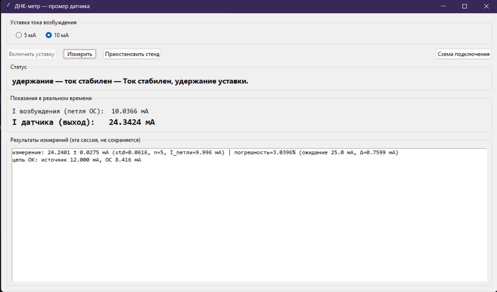
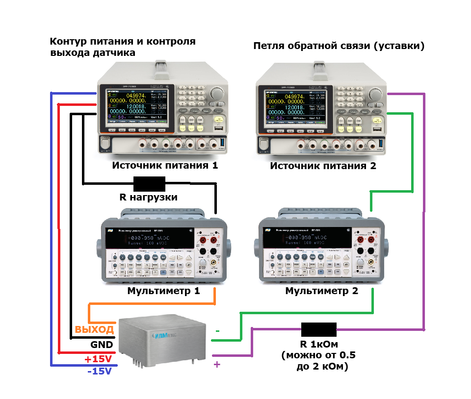

# ДНК-метр (IDM-DNKMeter)

Стенд для полуавтоматической калибровки/поверки датчиков ДНК-25 / ДНК-М: подаёт
ток возбуждения через датчик, удерживает его на заданной уставке, читает
выходной сигнал датчика и сразу же считает погрешность. Управление — из
простого настольного приложения (Windows), без командной строки.

Этот README рассчитан на то, что вы видите стенд первый раз. Если вы уже
разработчик проекта — раздел [«Разработчикам»](#разработчикам) ближе к концу.

---

## Быстрый старт

### 1. Установите NI-VISA

Без этого программа не увидит ни один прибор. Скачать:
**https://www.ni.com/en/support/downloads/drivers/download.ni-visa.html**

Поставьте с настройками по умолчанию, перезагрузка обычно не требуется.

### 2. Установите драйвер источника питания GW Instek

Источник питания GPP-4323 определяется Windows не как обычный виртуальный
COM-порт, а как специфичное устройство — без официального драйвера он вообще
не появится в системе (ошибка «код 28» в диспетчере устройств).

**GW Instek USB Driver Ver.1.0.0.3** —
**https://www.gwinstek.com/en-global/download/downloadFile/14674**

Это `driverSetup.exe` (инсталлятор на Inno Setup, издатель — `GWInstek, Inc.`).
Файл не подписан цифровой подписью, но скачивается с официального домена
gwinstek.com — это нормально для драйверов этого производителя. Установите
**с правами администратора** (правая кнопка мыши → «Запуск от имени
администратора»).

Мультиметры (АКИП, RIGOL) отдельных драйверов не требуют — они USB-TMC
устройства, определяются самим NI-VISA «из коробки».

### 3. Скачайте программу

> **Готовая сборка под Windows: [Releases на GitHub](https://github.com/alexlegoshin/IDM-DNKMetr/releases)**
> *(на момент написания этого README релиз ещё не опубликован — ссылка
> заготовлена заранее, сборка появится там же)*

Скачайте `.zip`, распакуйте **целиком, в отдельную папку**. Внутри — `DNKMeter.exe`
и несколько файлов и папок рядом с ним:

```
DNKMeter.exe
config.yaml
images/
instruments/
```

**Это важно**: `DNKMeter.exe` не работает сам по себе, отдельно от этой папки.
Он читает `config.yaml` и профили приборов из `instruments/` — если скопировать
только сам `.exe` куда-то ещё, программа не запустится (не сможет найти
настройки и профили приборов). Всегда запускайте `DNKMeter.exe` из той же
папки, куда распаковали архив.

При первом запуске Windows SmartScreen может показать предупреждение
«Windows защитила ваш компьютер» (файл не подписан цифровой подписью) —
нажмите «Подробнее» → «Выполнить в любом случае».

### 4. Соберите стенд

Запустите `DNKMeter.exe`. Появится окно:



Нажмите кнопку **«Схема подключения»** — откроется приблизительная схема
стенда (как приборы соединены между собой):



**Схема приблизительная** — она не показывает разъёмы, полярность, порядок
контактов и т.п. Она нужна только для общего понимания топологии (какой
прибор в какой петле, куда идёт GND/±15В/выход датчика). Реальные подключения
делайте по маркировкам на самих приборах и на датчике.

Кратко, по схеме: **источник питания** через **мультиметр обратной связи**
подаёт ток возбуждения на вход датчика; **выход датчика** через нагрузочный
шунт и **измерительный мультиметр** замыкается на землю. Два разных
мультиметра — это два разных физических прибора, не два режима одного и
того же.

**Перед первым измерением обязательно проверьте руками**, что всё физически
собрано и что нигде нет плохого контакта (особенно на клеммах мультиметров —
щупы должны быть в гнёздах A/мА, режим измерения тока, не V/Ω). Программа
частично умеет ловить обрыв цепи автоматически (см. ниже), но не может
проверить, правильно ли именно перепутаны провода.

### 5. Запустите измерение

В окне программы:

1. **Выберите уставку** — 5 мА или 10 мА (радиокнопки вверху).
2. Нажмите **«Включить уставку»**. Программа сама найдёт приборы на шине,
   проверит целостность цепи, подаст ток и выведет его на заданное значение.
   В поле «Статус» будет видно, что сейчас происходит (поиск приборов →
   бинарный поиск → стабилизация → удержание) — подробно это описано в
   разделе [«Как это работает внутри»](#как-это-работает-внутри). Показания
   тока обновляются в реальном времени.
3. Дождитесь статуса **«удержание — ток стабилен»**.
4. Нажмите **«Измерить»** — программа возьмёт несколько отсчётов измерительного
   мультиметра, усреднит их и сразу посчитает погрешность (см. ниже). Можно
   нажимать сколько угодно раз подряд, результаты добавляются в список внизу
   окна.
5. Когда закончили с этим датчиком — нажмите **«Приостановить стенд»**. Выход
   источника выключится, можно спокойно отключать/переподключать датчик.
6. Для следующего датчика — снова с шага 1.

**Программа ничего не сохраняет на диск**, кроме служебного `dnkmeter.log`
(см. ниже). Результаты измерений видны только на экране в текущем сеансе —
если нужно сохранить число, запишите/сфотографируйте его сами.

### Как считается погрешность

Датчик по входу — датчик **напряжения**, но вход специально откалиброван так,
чтобы через него шёл ток возбуждения ровно 5 или 10 мА (это и есть выбор
уставки). Для уставки **10 мА** заранее известно, каким ДОЛЖЕН быть выходной
ток датчика — **25 мА** (заявленный коэффициент преобразования вход:выход
1:2.5). Погрешность считается как простое относительное отклонение измеренного
среднего от этого ожидаемого значения:

```
δ = |I_измеренный − 25 мА| / 25 мА × 100%
```

Для уставки **5 мА** заранее неизвестно, каким должен быть выходной ток —
поэтому погрешность **честно не считается** (программа явно напишет об этом
в результате), вместо того чтобы придумывать ожидаемое значение произвольно.

### Если что-то пошло не так

Рядом с `DNKMeter.exe` при каждом запуске создаётся/дополняется файл
**`dnkmeter.log`** — в него пишется, какие приборы найдены, как они отвечали,
и полный текст любой ошибки. Если программа ведёт себя странно, выдаёт ошибку
или просто «не то» — **сохраните этот файл** и приложите при обращении за
помощью. Без него разобраться в проблеме постфактум практически невозможно.

---

## Поддерживаемые приборы

| Роль | Прибор | Статус |
|---|---|---|
| Источник питания | **GW Instek GPP-4323** | Проверено обширно, основной и единственный поддержанный источник |
| Мультиметр | **АКИП-B7-78/1** (Prist V7-78/1, платформа PicoTest) | **Проверено обширно, рекомендуется** — использовался и в контуре обратной связи, и на измерении на протяжении всей отладки |
| Мультиметр | **RIGOL DM3068** | Работает, но **крайне нестабильно** — периодически начинает показывать в разы (~40-60x) заниженный ток независимо от того, куда физически подключён. Причина не выяснена (есть подозрение на предохранитель токового входа, не подтверждено). **Настоятельно рекомендуем воздержаться от использования RIGOL с этим ПО** до выяснения причины. |
| Мультиметр | АКИП-2101 / Siglent SDM3055 | Профиль команд подготовлен (сверен по официальной документации Siglent), но **вживую ни разу не проверялся** — используйте на свой риск, сверьте команды перед доверием к показаниям. |

Если на стенде найдено ровно два мультиметра, программа сама определяет,
какой из них в контуре обратной связи, а какой на измерении (см.
[«Автообнаружение приборов»](#автообнаружение-приборов)) — вручную выбирать
не нужно.

Программа тестировалась на: Windows 11 Pro (сборка 10.0.26200), NI-VISA
(`visa32.dll` версии 8.0.7331.0), GW Instek GPP-4323 (прошивка V1.22, драйвер
USB Driver Ver.1.0.0.3), АКИП-B7-78/1 (прошивка 03.45-01-04), RIGOL DM3068
(прошивка 01.01.00.01.11.00). Другие версии NI-VISA/прошивок, скорее всего,
тоже будут работать, но специально не проверялись.

---

## Как это работает внутри

### Автообнаружение приборов

Вместо ручного указания VISA-адреса каждого прибора, программа (модуль
`discover.py`) сама опрашивает шину:

1. Перебирает все видимые VISA-ресурсы (`pyvisa.ResourceManager().list_resources()`).
2. Каждому шлёт `*IDN?` и сравнивает ответ с известными сигнатурами приборов
   (`idn_match` в `instruments/*.json`). Для источника питания (serial-порт)
   скорость связи заранее неизвестна — перебираются стандартные значения
   (9600, 19200, 38400, 57600, 115200), пока прибор не ответит; каждая
   попытка повторяется дважды на случай кратковременного сбоя связи.
3. Если найден один источник питания и один/два мультиметра — приборы
   назначаются автоматически. Если найдено два мультиметра, программа
   определяет, какой из них в контуре обратной связи, а какой на измерении:
   подаёт пробное напряжение и смотрит, чьи показания **ближе к показаниям
   самого источника питания** (оба меряют один и тот же физический ток в
   одной и той же петле возбуждения). Выход датчика — физически другая
   величина (может быть в разы больше входного тока за счёт усиления
   датчика), поэтому сравнение идёт не «у кого показания больше», а «кто
   ближе к источнику».
4. При любой неоднозначности (не тот прибор, больше двух мультиметров и
   т.п.) — понятная ошибка вместо угадывания.

Это поведение можно отключить и задать приборы вручную в `config.yaml`
(`instruments.auto_detect: false` + явные `profile`/`resource`).

### Три этапа выхода на уставку

Наивный способ — просто плавно поднимать напряжение маленькими шагами, пока
ток не дойдёт до уставки — работает, но медленно (десяток+ секунд только на
то, чтобы «нащупать» примерный рабочий диапазон). Вместо этого:

1. **Бинарный поиск** (`coarse_seed()`) — вместо линейного разгона, напряжение
   ищется делением диапазона `[0, 60В]` пополам: если ток меньше уставки —
   поднимаем нижнюю границу, если больше — опускаем верхнюю. Находит
   окрестность нужного напряжения за ~13 шагов вместо десятков (зависимость
   тока от напряжения у резистивной/квазирезистивной нагрузки монотонна, так
   что метод корректен). На каждом шаге специально выжидается достаточное
   время устаканивания — у реального датчика отклик заметно запаздывает, и
   слишком быстрый опрос давал систематический перезаброс.
2. **Базовая стабилизация** — обычный ПИ-регулятор (пропорционально-
   интегральный) в velocity-форме (на каждом шаге считается не абсолютное
   целевое напряжение, а *приращение* к текущему) доводит ток до уставки с
   разумным, но не идеальным допуском — быстро и надёжно.
3. **Точная подстройка** (необязательная) — после базовой стабилизации
   регулятор ещё какое-то время (отдельный бюджет времени) пытается дотянуть
   точность туже, вплотную к реальному шуму измерения. Если не успевает —
   не ошибка, просто остаётся на базовой точности.

### Удержание и отказоустойчивость

Пока уставка включена, ПИ-регулятор продолжает непрерывно подстраивать
напряжение в фоне — именно поэтому показания тока в окне обновляются
непрерывно, а не разово. Если контур вдруг теряет управляемость (напряжение
упёрлось в потолок, а ток далёк от уставки — типичный признак обрыва цепи или
переподключения датчика на другую нагрузку):

1. Сначала — узкая бисекция вокруг ТЕКУЩЕГО напряжения (быстрый пересев при
   небольшом сбое, не отбрасывает уже найденную рабочую точку).
2. Если не помогло — полный бинарный поиск с нуля по всему диапазону (для
   случая «всё слетело», например если датчик физически заменили на другой).
3. Если и это не помогло — понятная ошибка в статусе вместо зависания.

Финальное значение тока для «Измерить» — не единичный шумный отсчёт, а
среднее по нескольким подряд идущим измерениям (регулировка при этом не
останавливается).

### Безопасность

- Аппаратный лимит тока источника выставляется явно перед каждым измерением,
  с запасом выше уставки.
- Потолок напряжения источника (60В) — с запасом ниже паспортного максимума
  прибора (64В в используемом режиме tracking-series).
- Предполётная проверка целостности цепи обратной связи перед стабилизацией:
  подаётся пробное напряжение, и если показания мультиметра в контуре ОС не
  выросли — явная ошибка («обрыв цепи») вместо попытки регулировать
  несуществующий ток.
- Выход источника гарантированно выключается при «Приостановить стенд», при
  закрытии окна и при любой ошибке.

---

## Архитектура проекта

```
ui.py              — окно программы (Tkinter, без сторонних GUI-зависимостей)
bench.py           — логика стенда для интерактивного режима: старт уставки в
                      фоновом потоке, измерение, пауза (используется ui.py)
discover.py        — автообнаружение приборов и определение их ролей
drivers.py         — универсальный SCPI-драйвер, управляемый JSON-профилями
current_control.py — ПИ-регулятор и его аппаратный аналог (если у источника
                      есть свой режим CC)
accuracy.py        — расчёт относительной погрешности
measure.py          — пакетный CLI-режим (список датчиков из config.yaml, CSV) —
                      отдельный от UI сценарий, использует те же drivers.py/
                      current_control.py
main.py            — точка входа для пакетного CLI-режима (python main.py)
tune_current_loop.py — подбор коэффициентов ПИ-регулятора на модели нагрузки,
                      без железа
config.yaml        — все настройки: приборы, коэффициенты контура, уставки
instruments/*.json — по одному файлу на прибор: SCPI-команды + параметры связи
                      (см. instruments/README.md — как добавить новый прибор)
images/            — скриншот интерфейса и схема подключения
```

---

## Разработчикам

### Окружение для разработки

```bash
conda create -n dnkmetr python=3.11
conda activate dnkmetr
pip install -r requirements.txt
```

Дополнительно нужен **NI-VISA** (см. «Быстрый старт» выше) — без него
`pyvisa.ResourceManager()` не найдёт ни один прибор.

```bash
python ui.py         # интерактивный режим
python main.py        # пакетный CLI-режим (mode/список датчиков — из config.yaml)
```

`config.yaml` → `mode: fake` — работа без железа, на модели нагрузки
(`FakePowerSupply`/`FakeMultimeter`), удобно для отладки логики без стенда.

### Сборка exe

```bash
pip install pyinstaller
pyinstaller --onefile --windowed --name DNKMeter ui.py
```

После сборки `dist/DNKMeter.exe` нужно вручную докопировать рядом:
`config.yaml`, папку `instruments/`, папку `images/` — они **намеренно не
зашиваются внутрь exe** (PyInstaller `--onefile` распаковывает всё во
временную папку при каждом запуске), чтобы их можно было редактировать без
пересборки. `ui.py` и `discover.py` сами резолвят путь к этим файлам
относительно расположения exe (`sys.executable`), а не рабочей директории —
см. `BASE_DIR`/`_BASE_DIR` в начале этих файлов, если переносите этот
паттерн в новый код.

Если сборка ругается на отсутствующие DLL от NI-VISA — добавьте путь к
`Library/bin` активного conda-окружения через `--paths`:

```bash
pyinstaller --onefile --windowed --name DNKMeter --paths "<путь до conda>/envs/<env>/Library/bin" ui.py
```

### Как добавить новый прибор

См. `instruments/README.md` — там же описан формат JSON-профиля и как
работает автоопределение baud rate и модели прибора по `*IDN?`.

---

## Потенциал к расширению

Сейчас стенд — **полуавтомат на один датчик за раз**: оператор вручную
подключает датчик, жмёт «Включить уставку» → «Измерить» → «Приостановить
стенд», переподключает следующий датчик. Для серийной поверки это рабочий,
но не самый быстрый режим.

Заложенная точка расширения — автоматическая коммутация датчиков через
реле/мультиплексор (или отдельную плату на STM32, управляющую этим
мультиплексором): вместо ручного «отключил-подключил» между измерениями,
контроллер сам переключает высоковольтные/низковольтные линии на следующий
датчик из списка. В текущем коде это уже учтено на уровне API (`measure.py`,
пакетный CLI-режим уже работает со списком датчиков из `config.yaml` — не
хватает только замены ручной паузы «нажми Enter» на команду реальному
коммутатору). Это следующий логичный шаг, если понадобится измерять много
датчиков подряд без постоянного присутствия оператора у стенда.
